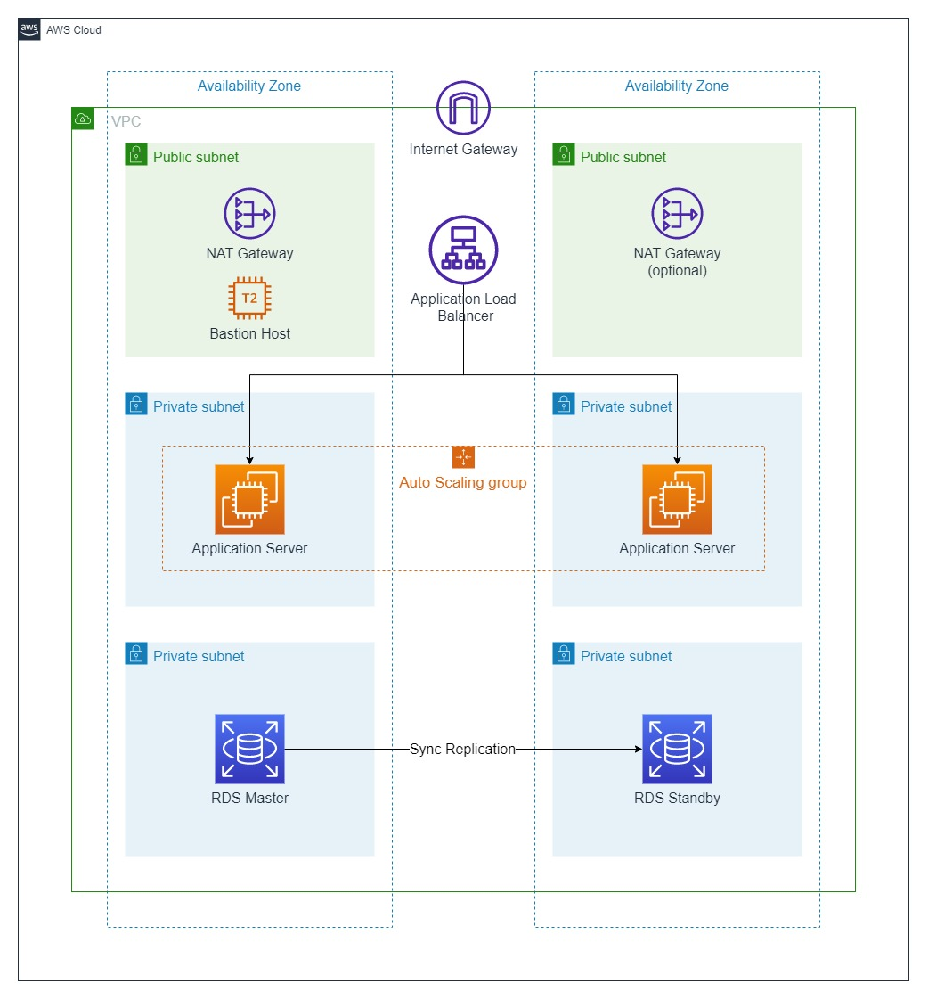
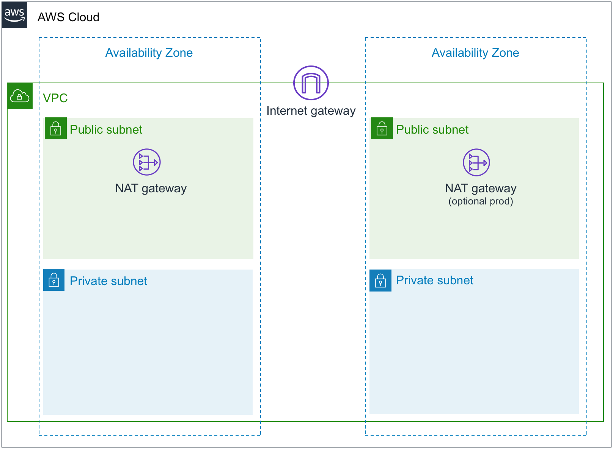

# Overview

This is a three-tier application with a simple backend that implements authentication, user management, upload, health features.
It also builds an infrastructure that creates all the necessary components to run the application on AWS, including a load balancer, EC2 instances, and an RDS instance, etc.

</br>

# Table of Contents

- [Getting Started](#getting-started)

  - [Installation](#installation)
  - [Deployment](#deployment)

- [Backend](#backend)

  - [Project Structure](#project-structure)

    - [API](#api)
    - [`Config`](#config)
    - [`Emails`](#emails)
    - [`Loaders`](#loaders)
    - [`Middlewares`](#middlewares)
    - [`Migrations`](#migrations)
    - [`Models`](#models)
    - [`Scripts`](#scripts)
    - [`Utils`](#utils)
    - [`app.js`](#appjs)
    - [`server.js`](#serverjs)

- [Infrastructure](#infrastructure)
  - [Diagram](#overview-1)
  - [Components](#components)
    - [Network](#network)
    - [Database](#database)
    - [Storage](#storage)
    - [Application](#application)

</br>

# Getting Started

## Installation

If you haven't already done so you first need to:

1. Clone the repo

   ```console
   git clone https://github.com/ahmednmourad/nodejs-three-tier-app.git
   ```

2. Install NPM packages

   You'll need to navigate to the backend folder first

   ```shell
   cd backend && npm install
   ```

3. Set environment variables

   You'll find all the information about the environment variables that you need for this project in `.env.sample`.

   Rename `.env.sample` to `.env` if you're running locally or `.env.production` if you're deploying the app on AWS,

4. Create a Sendinblue account for sending emails (optional)
5. Create an S3 bucket for saving photos if you wish to deploy the app (optional)
6. Run database migration script to startup the database

   ```bash
   npm run migrate
   ```

</br>

## Deployment

To Deploy the application on AWS, you'll have to:

1. Create an AWS account.

2. Deploy VPC stack

   Important! - This stack must be deployed before any other stack -- except S3 Stack :)

   ```
   aws cloudformation deploy \
   --template-file network/vpc.yaml \
   --stack-name project-vpc-stack
   ```

3. Create an S3 bucket for cloudFormation nested stacks

   ```bash
   aws cloudformation deploy \
    --template-file storage/s3.yaml \
    --stack-name nested-stacks-s3-bucket \
    --parameter-overrides \
    S3BucketName=ahmednmourad-nested-stacks-001
   ```

4. Deploy database stack

- To make it more convenient to deploy a stack with multiple parameters instead of passing parameters through the command line let's create a JSON file that contains all the parameters that this cloudformation stack needs and let's call it `cfn-parameters.json` (ignored by .gitignore).

  ```json
  {
    "Parameters": {
      "VpcStackName": "project-vpc-stack",
      "DbUsername": "username",
      "DbPassword": "password1234",
      "DbAlarmMinMemoryInMb": "128",
      "DbAlarmMaxReadIopsPerSecond": "2500",
      "DbAlarmMaxWriteIopsPerSecond": "2500",
      "DbAlarmMaxConnections": "100",
      "AlarmEmail": "ahmednmourad@gmail.com"
    }
  }
  ```

- Since this stack contains nested stacks we'll have to use `aws cloudformation package` first to upload the local artifacts (local paths) that the CloudFormation template references.

  ```bash
  	aws cloudformation package \
  	--template-file database/main.yaml \
  	--s3-bucket=ahmednmourad-nested-stacks-001 \
  	--output-template-file database/main-packaged.yaml
  ```

- After we successfully uploaded the local artifacts with the `package` command we can now deploy the package stack which is now called `main-packaged.yaml`

  ```
  aws cloudformation deploy \
  --template-file database/main-packaged.yaml \
  --stack-name project-database \
  --parameter-overrides file://database/cfn-parameters.json
  ```

5. Deploy an S3 bucket for storing users files & photos

   ```
   aws cloudformation deploy \
   --template-file storage/s3.yaml \
   --s3-bucket=ahmednmourad-project-bucket
   ```

6. Lastly, deploy the application stack

- Let's also create a `cfn-parameters.json` file for this stack

  ```json
  {
    "Parameters": {
      "VpcStackName": "project-vpc-stack",
      "DbHostname": "example.us-east-1.rds.amazonaws.com",
      "DbUsername": "username",
      "DbPassword": "password1234",
      "DbName": "projectDb",
      "BackendKeyName": "test",
      "BastionHostKeyName": "test",
      "AccessTokenSecretKey": "secret",
      "MailFromName": "Ahmad Nabil",
      "MailFromEmail": "ahmednmourad@gmail.com",
      "EmailApiKey": "test",
      "S3BucketName": "ahmednmourad-nested-stacks-001",
      "OperatorEmail": "ahmednmourad@gmail.com"
    }
  }
  ```

- This is also a nested stack so we'll have to use `aws cloudformation package` again.

  ```
  aws cloudformation package \
  --template-file application/main.yaml \
  --s3-bucket=ahmednmourad-nested-stacks-001 \
  --output-template-file main-packaged.yaml
  ```

- Finally to deploy it we'll run `aws cloudformation deploy`
  ```
  aws cloudformation deploy \
  --template-file application/main-packaged.yaml \
  --stack-name project-app-stack \
  --parameter-overrides file://application/cfn-parameters.json
  ```

# Backend

## Project Structure

Let's get right in and learn more about the project's structure. the folders in this project are organized by features not by type because In my opinion it's much easier to work with.

```

src/ 📁
└── api/ 📁
└── config/ 📁
└── emails/ 📁
└── loaders/ 📁
└── middlewares/ 📁
└── migrations/ 📁
└── models/ 📁
└── scripts/ 📁
└── utils/ 📁
└── app.js 📄
└── server.js 📄

```

We’ll go through every project component and its purpose.

### `API`

```

api/ 📁
└── auth/ 📁
└── user/ 📁
└── health/ 📁
└── upload/ 📁

```

You can see each folder represents a different module

Here's an example of what's included in the user folder.

```

api/ 📁
└── user/ 📁
├── user.controller.js 📄
├── user.route.js 📄
├── user.service.js 📄
└── user.test.js 📄
├── user.validation.js 📄

```

As you can see all the files related to the user are located here. If I want to add a separate file for validation, I just add a user.validation.js file to the user directory. If I want to add some tests, I can add user.test.js. Any files I need for user, go into the user directory. Simple.

If I need to support versioning I can just rename user to userV1 or maybe structure the api folder differently by including version number in the folder structure as follows:

```

api/ 📁
└── v1/ 📁
└── auth/ 📁
└── user/ 📁
└── health/ 📁
└── upload/ 📁
└── v2/ 📁
└── user/ 📁
...

```

### `Config`

Configuration files for third party APIs/services like amazon s3, db connection, etc.

### `Emails`

Contains all HTML code for the email templates that are sent to the user on different actions.

### `Loaders`

Split the startup process into modules

### `Middlewares`

This folder would contain all the middleware that you have created, whether it be authentication/some other function.

### `Migrations`

contains all the database schema migration files.

### `Models`

This folder would contain all your database schema files

### `Scripts`

For long running npm scripts

### `Utils`

The common functions that you would require multiple times throughout your code

### `app.js`

This file contains only the API declaration is separated from the network related configuration (port, protocol, etc). This allows testing the API in-process, without performing network calls, with all the benefits that it brings to the table: fast testing execution and getting coverage metrics of the code. It also allows deploying the same API under flexible and different network conditions. Bonus: better separation of concerns and cleaner code

### `server.js`

This file is basically be the entry point of the Node.js app

</br>

# Infrastructure

## Diagram



## Components

```

application/ 📁
├── bastion-host.yaml 📄
├── ec2-auto-scaling.yaml 📄
├── load-balancers.yaml 📄
├── main.yaml 📄
database/ 📁
├── alarms-topic.yaml 📄
├── cloudwatch-alarms.yaml 📄
├── event-notifications.yaml 📄
├── main.yaml 📄
├── rds.yaml 📄
network/ 📁
├── vpc.yaml 📄
storage/ 📁
├── s3.yaml 📄

```

### **Network**

`vpc.yaml`

The vpc.yaml template is a prerequisite for all other stacks. you need to run it first. It creates a private networking environment in which you can securely run AWS resources, along with related networking resources.

Subnets are isolated network areas--resources in public subnets are visible to the Internet, resources in private subnets can only be reached from inside the VPC. If a resource in a private subnet needs to communicate externally it has to do so via a NAT Gateway, which acts as a proxy.

The VPC template creates two public and two private subnets, in different Availability Zones (AZ) for redundancy. A subnet is public if it’s associated with an Internet gateway, which allow it to communicate with the Internet

Each subnet has to be associated with a route table, or set of network rules, that define allowed traffic. Route tables operate at the subnet level. The VPC template creates two of them: one for the public subnets, and one for the private.

Security groups act as firewalls at the instance level, to control inbound and outbound traffic. The template creates security groups for an application, load balancer, database, and bastion host.

<details>
	<summary>Resources Created</summary>

- 1 Amazon Virtual Private Cloud
- 2 Public subnets
- 2 Private subnets
- 1 Internet gateway
- 1 NAT gateway
- 3 route tables
- A bunch of security groups.

</details>

<details>
	<summary>Diagram</summary>



</details>

</br>

### **Database**

- `rds.yaml`

  This stack creates an RDS database instance

- `cloudwatch-alarms.yaml` (optional)

  This template sets up alarms to monitor the health and performance of an AWS RDS database instance. It includes alarms triggered by specific metrics like CPU usage, memory, connections, and I/O operations exceeding certain thresholds. Notifications are sent to an SNS topic specified in the stack's parameters. AWS CloudWatch is used to monitor the database's performance, and when alarms are triggered, notifications are sent to the specified SNS topic. This stack is designed to be used to quickly and easily deploy a set of alarms for monitoring an AWS RDS database instance.

- `event-notifications.yaml` (optional)

  This template sets up an RDS event subscription to send notifications to an SNS topic when specific database events occur. The user can provide a list of instances to subscribe to, and the subscription is configured to send notifications for some event categories. These categories include failover, failure, low storage, maintenance, etc.

- `alarms-topic.yaml` (optional)

  This template creates an database alarm SNS topic which listen for database events either from cloudwatch-alarms.yaml or event-notifications.yaml

- `main.yaml`

  This is the parent template which deploys all the nested templates (do not deploy nested stacks separately) including rds.yaml, cloudwatch-alarms.yaml, event-notifications.yaml, and alarms-topic.yaml.

</br>

### **Storage**

- `s3.yaml`

  This template creates an S3 bucket.

</br>

### **Application**

- `load-balancers.yaml`

  This template creates an Elastic Load Balancer for the backend application that spans multiple Availability Zones in a region.
  The load balancer has a simple health check against the default app health route.

- `ec2-auto-scaling.yaml`

  This template provisions an Auto Scaling Group that creates one or more Amazon EC2 instance running a Node.js backend application.
  An Elastic Load Balancing load balancer is attached to the Auto Scaling group, which acts as a single point of contact for all incoming traffic to the Auto Scaling group. The application scales automatically based on CPU utilization of the backend servers and is spread across multiple Availability Zones for high availability. Notifications will be sent to the operator email address on scaling events.

- `bastion-host.yaml`

  This template creates a bastion host, which is a publicly accessible EC2 instance that enables secure access to private resources within a VPC. The bastion host acts as a gateway, providing authorized users with secure access to private instances without the need to expose them directly to the internet.

- `main.yaml`

  This is the parent template which deploys all the nested templates (do not deploy nested templates separately) including load-balancers.yaml, ec2-auto-scaling.yaml, and bastion-host.yaml.
